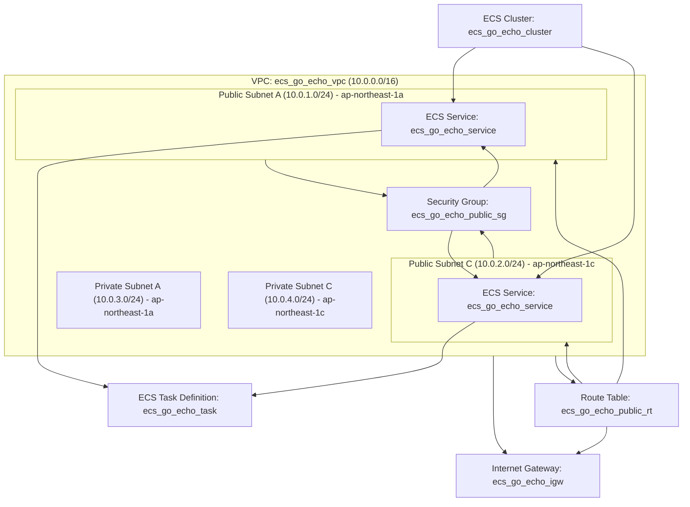

```mermaid
graph TD
    subgraph VPC["VPC: ecs_go_echo_vpc (10.0.0.0/16)"]
        subgraph PublicSubnetA["Public Subnet A (10.0.1.0/24) - ap-northeast-1a"]
            ECSServiceA["ECS Service: ecs_go_echo_service"]
        end
        subgraph PublicSubnetC["Public Subnet C (10.0.2.0/24) - ap-northeast-1c"]
            ECSServiceC["ECS Service: ecs_go_echo_service"]
        end
        PrivateSubnetA["Private Subnet A (10.0.3.0/24) - ap-northeast-1a"]
        PrivateSubnetC["Private Subnet C (10.0.4.0/24) - ap-northeast-1c"]
        SG["Security Group: ecs_go_echo_public_sg"]
    end
    IGW["Internet Gateway: ecs_go_echo_igw"]
    RT["Route Table: ecs_go_echo_public_rt"]
    ECSCluster["ECS Cluster: ecs_go_echo_cluster"]
    ECSTask["ECS Task Definition: ecs_go_echo_task"]

    VPC --> IGW
    VPC --> RT
    RT --> IGW
    RT --> PublicSubnetA
    RT --> PublicSubnetC
    PublicSubnetA --> SG
    PublicSubnetC --> SG
    SG --> ECSServiceA
    SG --> ECSServiceC
    ECSServiceA --> ECSTask
    ECSServiceC --> ECSTask
    ECSCluster --> ECSServiceA
    ECSCluster --> ECSServiceC
```
